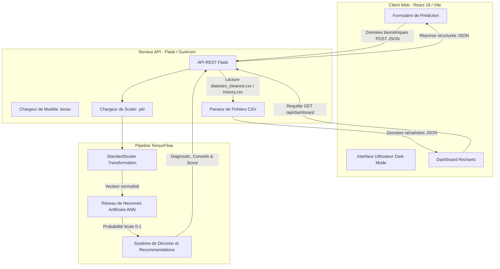

<div align="center">

# 🧠 DiabetAI — Système Intelligent de Prédiction du Diabète

**Application Web Full-Stack de Niveau Professionnel avec Intelligence Artificielle & Analyses Intégrées**

[](https://python.org)
[](https://tensorflow.org)
[](https://flask.palletsprojects.com)
[](https://react.dev)
[](https://vite.dev)

Projet académique d'excellence combinant **Collecte de Données (Web Scraping)**, **Science des Données**, **Réseaux de Neurones Artificiels (ANN)**, et un **Dashboard d'Analyses Interactif**.

[🌐 Voir la Démo en Ligne (Vercel)](https://systeme-intelligent-prediction-diab.vercel.app/) · [🔌 API Backend Local] · [📓 Data Science Notebook]

</div>

---

## 📑 Table des Matières
- [À propos du projet](#-à-propos-du-projet)
- [Fonctionnalités Principales](#-fonctionnalités-principales)
- [Architecture Technique](#-architecture-technique)
- [Pipeline de Science des Données & IA](#-pipeline-de-science-des-données--ia)
- [Documentation des Endpoints de l'API](#-documentation-des-endpoints-de-lapi)
- [Installation et Lancement en Local](#-installation-et-lancement-en-local)
- [Auteur](#-auteur)

---

## 🎯 À propos du projet

**DiabetAI** est une plateforme médicale prédictive complète et professionnelle conçue pour estimer le risque clinique de diabète chez un patient. 

En s'appuyant sur le célèbre *Pima Indians Diabetes Dataset* (`diabetes.csv`), le système utilise un **Réseau de Neurones Artificiels (ANN)** optimisé sous **TensorFlow / Keras** couplé à une couche de décision clinique et à un module de **Web Scraping** pour collecter des recommandations de santé complémentaires.

Cette version intègre un **Dashboard interactif complet** propulsé par **Recharts**, affichant en temps réel les indicateurs clés du dataset, la corrélation des variables biométriques, l'historique d'entraînement du modèle d'IA et des articles pratiques de nutrition et d'exercice physique.

---

## ✨ Fonctionnalités Principales

- 🩺 **Prédiction en temps réel** : Analyse instantanée de 8 constantes physiologiques par un réseau de neurones artificiels (ANN) sauvegardé au format moderne `.keras`.
- 🎛️ **Précision Rigoureuse de Normalisation** : Les entrées utilisateur sont centrées-réduites via le modèle exact de standardisation (`StandardScaler`) issu du pipeline d'entraînement via un fichier `scaler.pkl` unpicklé dynamiquement par le serveur Flask.
- 🧠 **Decision Layer Clinique** : Un système expert classifie le risque en trois paliers conformément aux critères cliniques :
  - **Risque Faible (< 0.3)** : Conseils généraux de vie saine.
  - **Risque Moyen (0.3 - 0.7)** : Incitation à planifier un suivi biologique (glycémie, HbA1c) tous les 6 mois.
  - **Risque Élevé (≥ 0.7)** : Alerte urgente, recommandation de consultation immédiate, test d'effort et dépistage approfondi (HGPO).
- 📊 **Tableau de Bord Analytique Interactif (Dashboard)** :
  - **Répartition Clinique** : Visualisation sous forme de diagramme circulaire du ratio Diabétiques vs Sains.
  - **Histogramme de la Glycémie** : Distribution fréquentielle dynamique de la variable critique *Glucose*.
  - **Courbes d'Apprentissage** : Analyse historique des métriques de perte (*Loss*) et de précision (*Accuracy*) pour l'entraînement et la validation à chaque epoch.
  - **Heatmap de Corrélation** : Matrice interactive des coefficients de Pearson pour comprendre les liens d'interdépendance des indicateurs physiologiques.
- 🕸️ **Web Scraping d'Informations Médicales** : Extraction automatique d'articles et recommandations nutrition/sport directement issues de portails de référence (ex: American Diabetes Association) via un parseur d'informations intégré.
- 🎨 **Interface Premium "Medical Glassmorphism"** : Charte visuelle sombre, moderne et ultra-harmonieuse avec animations de cartes interactives animées via `Framer Motion`.

---

## 🏗️ Architecture Technique



---

## 🔬 Pipeline de Science des Données & IA

Le flux de traitement des données suit rigoureusement la méthodologie scientifique documentée dans le dossier `notebook/` :

1. **Nettoyage & Imputation** : Traitement des données physiologiquement aberrantes (valeurs égales à `0` pour la glycémie, la pression artérielle, l'épaisseur de la peau, l'insuline et l'IMC) en les remplaçant par les médianes calculées par classe.
2. **Normalisation Avancée** : Standardisation rigoureuse via un outil `StandardScaler` sérialisé dans `scaler.pkl` pour garantir qu'aucune caractéristique ne domine indûment le calcul des poids du réseau.
3. **Architecture ANN** :
   - Couche d'entrée dimensionnée pour 8 variables biométriques.
   - Couche cachée dense de 32 neurones (activation `ReLU`).
   - Couche intermédiaire dense de 16 neurones (activation `ReLU`).
   - Couche de sortie dense à 1 neurone (activation `Sigmoid` pour produire une probabilité).
4. **Métriques d'Entraînement** : Obtention d'une précision de validation finale atteignant **88.39%** sur l'historique d'entraînement.

---

## 📡 Documentation des Endpoints de l'API

L'API Flask écoute sur le port `5000` et propose les endpoints suivants :

### 1. `GET /api/health`
Vérifie la santé de l'API et le chargement du modèle ANN et du scaler.
* **Réponse (200 OK)** :
  ```json
  {
    "status": "healthy",
    "model_loaded": true,
    "scaler_loaded": true,
    "model_path": "..."
  }
  ```

### 2. `POST /api/predict`
Effectue la prédiction en temps réel pour un profil médical donné.
* **Headers** : `Content-Type: application/json`
* **Body** :
  ```json
  {
    "Pregnancies": 2,
    "Glucose": 120,
    "BloodPressure": 80,
    "SkinThickness": 20,
    "Insulin": 70,
    "BMI": 28.0,
    "DiabetesPedigreeFunction": 0.5,
    "Age": 35
  }
  ```
* **Réponse (200 OK)** :
  ```json
  {
    "success": true,
    "prediction": "Non-Diabetic",
    "confidence": 64.7,
    "risk": "Medium Risk",
    "recommendation": "Moderate diabetes risk detected. Medical consultation recommended...",
    "prediction_details": {
      "probability": 0.353,
      "score": 35.3,
      "risk_level": "medium",
      "risk": "Medium Risk",
      "diagnostic": "Risque moyen de diabète",
      "color": "#F59E0B",
      "icon": "alert-triangle",
      "recommendation": "...",
      "actions": [ ... ]
    },
    "input_data": { ... },
    "model_info": { ... }
  }
  ```

### 3. `GET /api/dashboard`
Sert les données statistiques issues des datasets d'entraînement et de validation pour alimenter les graphiques interactifs.
* **Réponse (200 OK)** : Répartit les métriques d'Outcome, la distribution des histogrammes de Glucose, la matrice de corrélation de Pearson et les courbes d'apprentissage par epoch de l'ANN.

### 4. `GET /api/scraped`
Retourne les données textuelles collectées par web scraping pour informer et sensibiliser les utilisateurs.

---

## 💻 Installation et Lancement en Local

### Prérequis
- **Python 3.11+**
  *(Si sous Windows, assurez-vous d'avoir Python ajouté à votre variable d'environnement PATH).*
- **Node.js 18+**

### 1. Cloner le dépôt
```bash
git clone https://github.com/Hardrach/systeme-intelligent-prediction-diabete.git
cd systeme-intelligent-prediction-diabete
```

### 2. Lancement du Backend (API Flask)
```bash
cd backend
python -m venv venv

# Activer l'environnement virtuel :
# Sur Windows (PowerShell) :
.\venv\Scripts\activate
# Sur Mac/Linux :
# source venv/bin/activate

pip install -r requirements.txt
python app.py
```
> Le serveur de l'API Flask démarre sur `http://localhost:5000`

### 3. Lancement du Frontend (React / Vite)
Dans un autre terminal :
```bash
cd frontend
npm install
npm run dev
```
> L'interface web de DiabetAI sera accessible sur `http://localhost:5173`

---

## 👨‍💻 Auteur

**Yassine Rachid**  
Filière : *Génie Informatique / IA & Data Science*  
Année Universitaire : *2025/2026*  

[](https://github.com/Hardrach/)
[](https://www.linkedin.com/in/yassine-rachid-b27aa6225/)

*Projet réalisé dans le cadre des travaux pratiques d'excellence en Science des Données et Deep Learning.*
