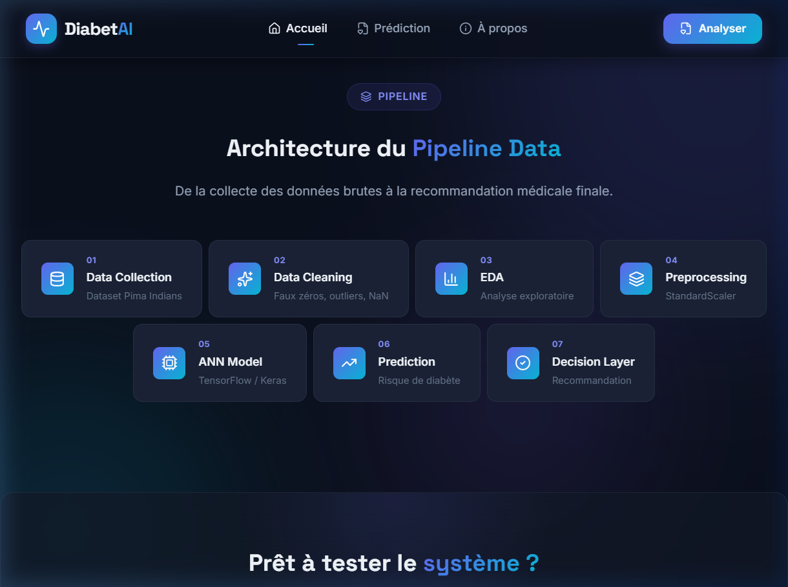
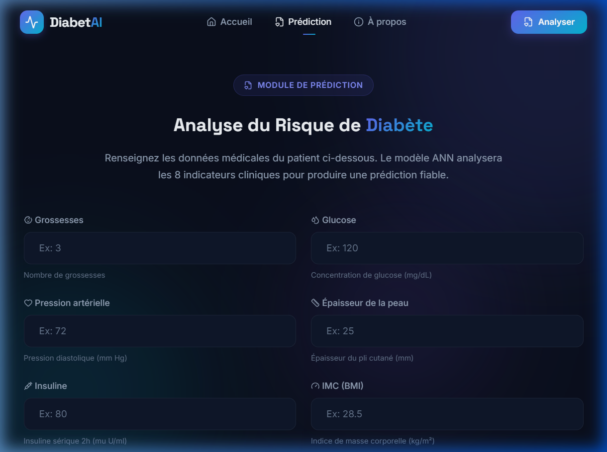
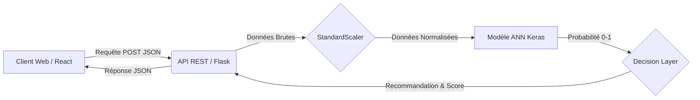

<div align="center">

# 🧠 DiabetAI — Système Intelligent de Prédiction du Diabète

**Application Web Full-Stack avec Intelligence Artificielle intégrée**

[](https://python.org)
[](https://tensorflow.org)
[](https://flask.palletsprojects.com)
[](https://react.dev)
[](https://vite.dev)

Projet académique d'excellence combinant **Science des Données** et **Intelligence Artificielle Avancée**.

</div>

---

## 📑 Table des Matières
- [À propos du projet](#-à-propos-du-projet)
- [Fonctionnalités Principales](#-fonctionnalités-principales)
- [Architecture Technique](#-architecture-technique)
- [Pipeline d'Intelligence Artificielle](#-pipeline-dintelligence-artificielle)
- [Installation en Local](#-installation-en-local)
- [Documentation de l'API](#-documentation-de-lapi)
- [Auteur](#-auteur)

---

## 🎯 À propos du projet

**DiabetAI** est une plateforme médicale prédictive conçue pour estimer le risque clinique de diabète chez un patient. En s'appuyant sur le célèbre *Pima Indians Diabetes Dataset*, un réseau de neurones artificiels (ANN) a été entraîné pour analyser 8 indicateurs biométriques.

Le projet est divisé en trois pôles d'expertise :
1. **Data Science** : Nettoyage des données, traitement des valeurs aberrantes (faux zéros) et normalisation (StandardScaler).
2. **Deep Learning** : Modèle ANN Keras/TensorFlow optimisé, couplé à une couche de décision (Decision Layer) fournissant des recommandations médicales exploitables.
3. **Ingénierie Full-Stack** : Architecture découplée avec une API REST performante (Flask) et une interface utilisateur moderne et réactive (React/Vite) utilisant le Glassmorphism.

---

## ✨ Fonctionnalités Principales

- 🩺 **Prédiction en temps réel** via un réseau de neurones artificiels (ANN).
- 🧠 **Decision Layer métier** classifiant le risque en 3 niveaux (Faible, Moyen, Élevé) avec recommandations associées.
- 🎨 **Interface premium "Medical Dark Theme"** avec animations fluides (Framer Motion).
- 🛡️ **Validation stricte des données** côté client et serveur.

---

## 📸 Aperçu de l'application

| Accueil & Pipeline | Formulaire de Prédiction |
| :---: | :---: |
|  |  |

<p align="center">
  <b>Contexte Académique & Méthodologie</b><br/>
  
</p>

---

## 🏗️ Architecture Technique



---

## 🔬 Pipeline d'Intelligence Artificielle

L'intelligence du système a été forgée via un processus rigoureux (disponible dans le dossier `notebook/`) :

1. **Data Cleaning** : Remplacement des zéros physiologiquement impossibles par la médiane.
2. **EDA** : Analyse exploratoire approfondie via corrélations et distributions.
3. **Preprocessing** : `StandardScaler` pour centrer et réduire les données.
4. **Modélisation ANN** : Architecture dense (32 ➜ 16 ➜ 1) avec activation `ReLU` et `Sigmoid`.
5. **Compilation** : Optimiseur `Adam`, perte `Binary Crossentropy`.

> **Précision obtenue (Accuracy)** : ~75 - 82% sur les données de test.

---

## 💻 Installation en Local

### Prérequis
- **Python 3.11+**
- **Node.js 18+**

### 1. Cloner le dépôt
```bash
git clone https://github.com/Hardrach/diabetai.git
cd diabetai
```

### 2. Démarrer le Backend (API Flask)
```bash
cd backend
python -m venv venv
# Sur Windows :
.\venv\Scripts\activate
# Sur Mac/Linux :
# source venv/bin/activate

pip install -r requirements.txt
python app.py
```
> L'API sera accessible sur `http://localhost:5000`

### 3. Démarrer le Frontend (React)
Dans un nouveau terminal :
```bash
cd frontend
npm install
npm run dev
```
> L'interface sera accessible sur `http://localhost:5173`

*(Note : Si sous Windows vous avez une erreur d'exécution de script PowerShell, tapez `Set-ExecutionPolicy -Scope Process -ExecutionPolicy Bypass` avant vos commandes).*

---

## 📡 Documentation de l'API

L'API REST du backend accepte les requêtes `POST` pour générer une prédiction.

### `POST /api/predict`

**Headers:**
`Content-Type: application/json`

**Body:**
```json
{
  "Pregnancies": 3,
  "Glucose": 120,
  "BloodPressure": 72,
  "SkinThickness": 25,
  "Insulin": 80,
  "BMI": 28.5,
  "DiabetesPedigreeFunction": 0.45,
  "Age": 33
}
```

**Réponse (200 OK) :**
```json
{
  "success": true,
  "prediction": {
    "probability": 0.2854,
    "score": 28.54,
    "risk_level": "low",
    "diagnostic": "Faible risque de diabète",
    "color": "#10B981",
    "icon": "shield-check",
    "recommendation": "Votre profil médical ne présente pas de signes...",
    "actions": ["Maintenir une alimentation...", "..."]
  },
  "input_data": { ... },
  "model_info": { "type": "Artificial Neural Network (ANN)", ... }
}
```

---

## 👨‍💻 Auteur

**Yassine Rachid**  
Filière : *Génie Informatique*  
Année Universitaire : *2025/2026*  

[](https://github.com/Hardrach/)
[](https://www.linkedin.com/in/yassine-rachid-b27aa6225/)

Projet soutenu dans le cadre des modules **Science des Données** et **Intelligence Artificielle Avancée**.
